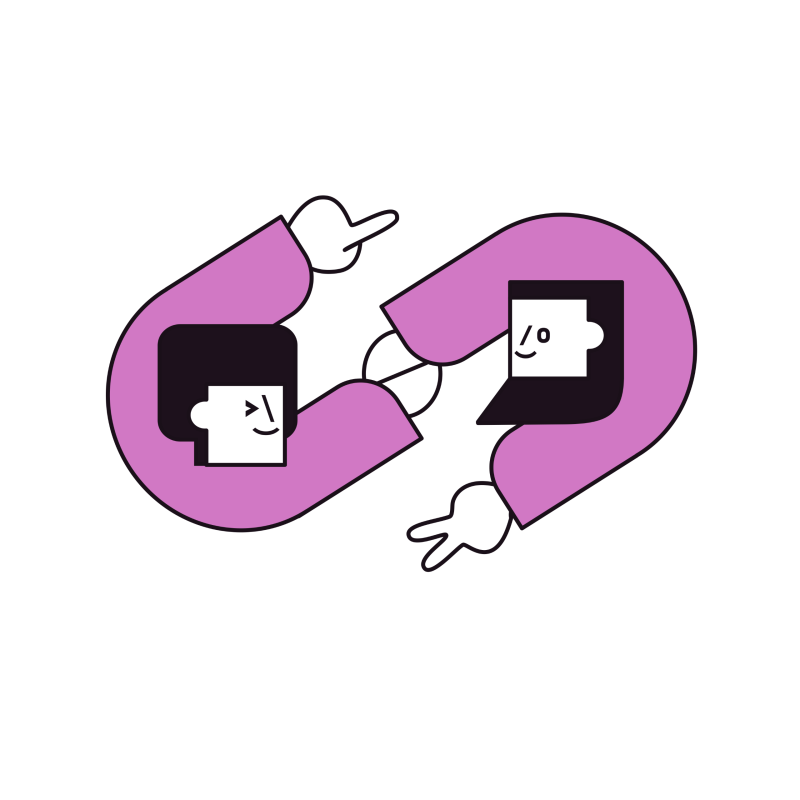
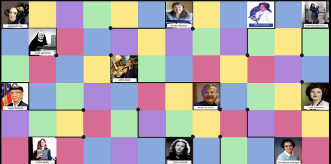
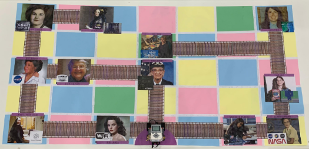
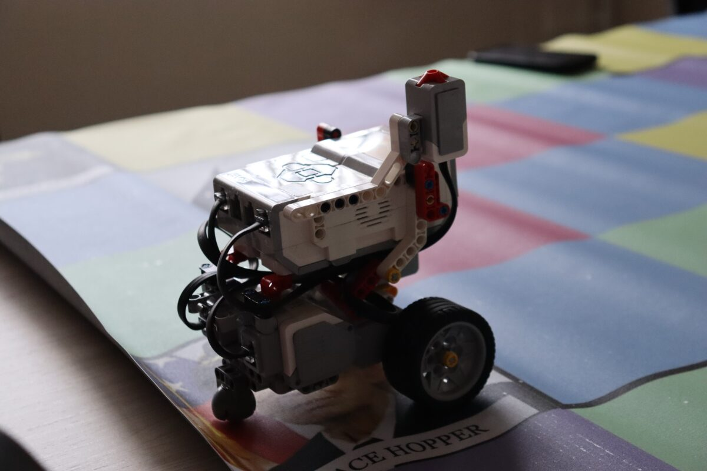
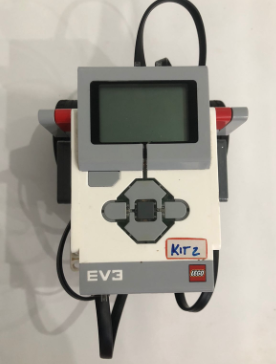

# VALERINAS
O grupo Valerinas representa as Meninas Digitais do Alto Vale, uma iniciativa da UDESC, de parceria com as Meninas Digitais. Nossa missão principal é garantir a permanência das estudantes no curso de Engenharia de Software, promovendo um ambiente de apoio mútuo entre as alunas, além de atrair mais mulheres para a área.

O curso enfrenta o desafio de um baixo número de estudantes do gênero feminino, e nosso objetivo é não apenas incentivar as alunas atuais a se manterem no curso, mas também despertar o interesse pela tecnologia desde cedo, especialmente entre crianças e adolescentes, com foco em inspirar garotas a se apaixonarem por esse universo. Acreditamos que, ao fortalecer a presença feminina em áreas da tecnologia, podemos criar uma rede de apoio a todas.  >.<

# 🟡 Rota das Exploradoras 
**Objetivo do Jogo: Inspirando a Próxima Geração de Mulheres na Tecnologia.**

O jogo foi desenvolvido para apresentar às crianças de 9 a 14 anos a inspiradora trajetória de mulheres que, com coragem e determinação, desbravaram o campo da tecnologia, enfrentando e superando desafios em ambientes predominantemente masculinos. Pioneiras como Ada Lovelace, reconhecida como a primeira programadora de computadores, e Grace Hopper, criadora do primeiro compilador, abriram caminho com suas contribuições inovadoras.Essas mulheres mostraram ao mundo que criatividade, inteligência e determinação transcendem barreiras de gênero. O grupo das Valerinas visa criar um ambiente inclusivo, onde as conquistas de mulheres pioneiras e contemporâneas sejam reconhecidas, inspirando novas gerações a prosperar e desenvolver habilidades em robótica e tecnologia. Queremos incentivar meninas a explorar o campo da tecnologia e a trilhar seus próprios caminhos.

# 🔵 Regras do Jogo
O jogo ocorre em um tabuleiro quadriculado onde estão representadas 12 mulheres que marcaram a história da tecnologia, como Ada Lovelace e Grace Hopper.

- Equipes: Formadas livremente para deixar o jogo mais dinâmico.
  
 Pontuação:
- Pontuação Inicial: Todos os grupos começam com 5 pontos.
- O robô perde 1 ponto ao sair da rota.
- O robô ganha 2 pontos ao seguir a rota correta.
  
Jogabilidade: Em cada rodada, um membro de cada equipe responde a uma pergunta, e o jogo segue até o final. Ganha a equipe com mais pontos acumulados.

 # 🟣 Mulheres Abordadas

- Ada Lovelace – Matemática e primeira programadora da história, desenvolveu o primeiro algoritmo para a máquina analítica de Charles Babbage.

- Grace Hopper – Cientista da computação que criou o primeiro compilador de linguagens e participou do desenvolvimento da linguagem COBOL.

- Hedy Lamarr – Inventora e atriz que colaborou na criação de um sistema de comunicação que serviu de base para o Wi-Fi e GPS atuais.

- Katherine Johnson – Matemática da NASA, essencial para o sucesso das primeiras missões espaciais, incluindo o envio do homem à Lua.

- Jean Jennings Bartik – Uma das programadoras do primeiro computador eletrônico, enfrentou desafios em uma época sem ferramentas de programação consolidadas.

- Margaret Heafield Hamilton – Diretora de software no MIT, desenvolveu o programa de voo da missão Apollo 11.

- Radia Perlman – Engenheira de redes conhecida como "mãe da Internet", criou o protocolo STP, essencial para redes seguras e sem falhas.

- Anita Borg – Fundadora do Instituto Anita Borg e da conferência Grace Hopper Celebration, que promove a inclusão de mulheres na tecnologia.

- Frances E. Allen – Primeira mulher a ganhar o Prêmio Turing; revolucionou a computação com suas contribuições para otimização de compiladores e computação paralela.

- Mary Jackson – Primeira engenheira aeroespacial negra da NASA, contribuiu com estudos em aerodinâmica e defendeu igualdade na ciência.

- Carol Shaw – Primeira mulher a desenvolver um jogo eletrônico, inspirando gerações de mulheres na indústria dos games.

- Mary Kenneth Keller – Freira e primeira mulher a obter doutorado em computação, atuou pela inclusão feminina na informática e no uso educacional de computadores.

#  🟢 Perguntas

(1) Considerada a primeira programadora do mundo  

**Resposta: Ada Lovelace**

(2) Qual é a mulher conhecida como mãe da internet?   

**Resposta: Radia Perlman**

(3) Criou o primeiro compilador para uma linguagem de programação.  

**Resposta: Grace Hopper**

(4) Integrante da equipe que enviou o primeiro homem à lua.

**Resposta: Margaret Heafield Hamilton** 

(5) Colaborou na criação de um sistema de comunicação espalhada que deu origem a tecnologias como wi-fi e bluetooth.  

**Resposta: Hedy Lamarr** 

(6) Foi uma das programadoras a desenvolver um computador eletrônico. 

**Resposta: Jean J. Bartik**

(7) Inventou o protocolo Spanning Tree Protocol (STP), que é fundamental para a operação de redes de computadores.  

**Resposta: Radia Perlman** 

(8) Primeira mulher a ganhar o Prêmio Turing.  

**Resposta: Frances Allen** 

(9) Fundou o Grace Hopper Celebration of Women in Computing, a maior conferência de mulheres em tecnologia do mundo. 

**Resposta: Anita Borg**

(10) Ela desenvolveu o código do software usado para identificar aeronaves inimigas.  

**Resposta: Margaret Hamilton** 

(11) Se tornou líder da equipe que atuava no projeto Apollo da NASA.  

**Resposta: Margaret Hamilton**  

(12) Primeira mulher a ser PhD em ciências da computação?  

**Resposta: Mary K Keller**

(13) Considerada a primeira mulher a desenvolver um jogo eletrônico.  

**Resposta: Carol Shaw**

(14) Primeira mulher negra a ser engenheira da NASA?  

**Resposta: Mary Jackson**

(15) Seu trabalho em otimização de compiladores e computação paralela foi revolucionário.  

**Resposta: Frances Allen** 

#  🟠 Tabuleiro

Nosso tabuleiro oficial foi enviado para impressão em uma gráfica, utilizando como base um banner com dimensões de 240 cm de largura por 120 cm de altura, composto por quadrados de 20 cm x 20 cm. Se você desejar baixar o molde original em PDF, disponibilizaremos o link aqui para facilitar o acesso.  Abaixo, você pode conferir a imagem da versão mais recente do tabuleiro:

>Figura 1: Imagem Ilustrativa do Tabuleiro Oficial 

#  🟠 Segunda Opção: Tabuleiro Manual

Para facilitar a criação de novos jogos, disponibilizamos uma lista de materiais simples e acessíveis para montar o tabuleiro, caso o grupo que esta desenvolvendo não tenha recursos para imprimir o tabuleiro em gráfica:

- 35 Folhas coloridas A4: Para compor o fundo e destacar o tabuleiro.
- 12 imagens de exploradoras: Impressas e recortadas. Essas imagens representam as pioneiras da tecnologia e devem ser posicionadas conforme o manual.
- Fita adesiva: Para fixar as imagens e demais elementos.
- Cola: Para garantir a aderência dos itens.
- Imagens de pontes: Representando as rotas que o robô deve seguir no jogo.
  
**Instruções de Montagem do Tabuleiro:**

Preparação dos Quadrados: Utilize cada folha A4 colorida para representar um quadrado do tabuleiro. Monte os 35 quadrados de forma que formem uma grade que se adapte ao espaço.

Posicionamento das Exploradoras: Conforme o manual, selecione 12 quadrados específicos para colar as imagens das exploradoras.

Criação das Rotas: Adicione imagens de pontes ou outros marcadores visuais para criar o caminho que o robô deverá seguir. As pontes devem ser coladas nos quadrados que compõem a rota correta.

Fixação: Utilize fita adesiva e cola para fixar cada elemento e garantir que o tabuleiro fique estável e os componentes não se soltem durante o jogo.

>Figura 2: Imagem Ilustrativa do protótipo final do tabuleiro

>Figura 3: Imagem Ilustrativa do robô utilizado no jogo. 

#  🔴Robô
**MODO DE USO** 

O robô foi programado pelo Laboratório de Robótica da UDESC com base no tabuleiro previamente descrito, integrando funções específicas de movimentação. A dinâmica inicia com o participante planejando mentalmente a rota que o robô deve seguir. Após cada clique, o movimento correspondente é registrado e armazenado. Ao final, quando todos os comandos forem programados, o trajeto completo é executado após o clique no botão de conclusão.
Os movimentos desenvolvidos para o robô incluem os comandos de avançar, no botão de cima, virar à esquerda, virar à direita, além das opções de cancelar o último comando, no botão de baixo, e concluir o trajeto. Essa abordagem permite que os participantes pratiquem habilidades de lógica e programação de forma interativa e prática.

>Figura 4: Imagem frontal do robô utilizado no jogo.

Caso o seu projeto esteja se baseando no nosso, estaremos disponibilizando o código do robô no link abaixo, se sinta livre para implementa-lo!!

[📄 Baixar o PDF](PDF-Robo)

# ⭐ Contato  

Caso tenha dúvidas ou sugestões, você pode me encontrar em:  
📧 E-mail: [Valerinas](valerinas.ceavi@udesc.br)  
📷 Instagram: [Valerinas]([https://github.com/SeuGitHub](https://www.instagram.com/valerinas.udesc?igsh=NjVkM212eWVkY3hl))  
